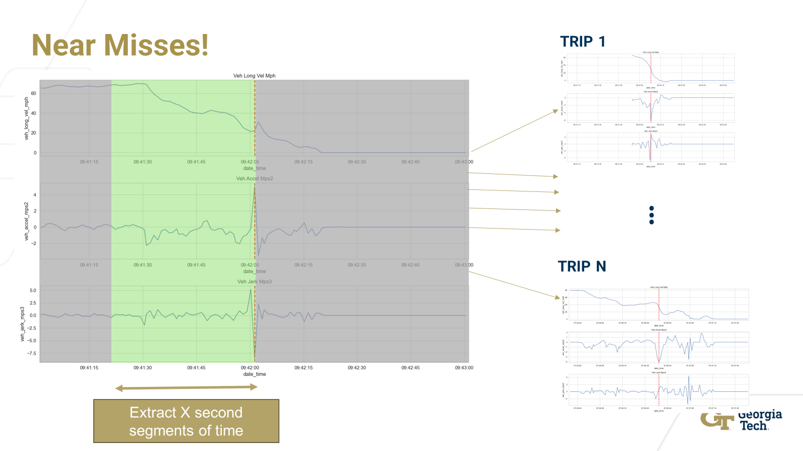

# Near Miss Algorithm Framework

This repository provides a comprehensive framework for analyzing and visualizing BlueCruise trip data. It includes Jupyter notebooks for extracting near-miss sequences and performing detailed vehicle testing data analysis using Google Cloud's BigQuery and a suite of powerful Python libraries.

<p align="center">
  
</p>

## Table of Contents

- [Setup](#setup)
- [Virtual Environment](#virtual-environment)
- [Usage](#usage)
    - [1 -- Extract Trips](#step-1-extract-relevant-bluecruise-trip-data)
    - [2a -- Extract Near Miss Sequences (Fingerprint)](#2a-extract-near-miss-sequences-fingerprint)
    - [2b -- Extract Near Miss Sequences (Event Timestamp)](#2b-extract-near-miss-sequences-event-timestamp)
    - [2c -- Extract Near Miss Sequences (Maneuvers)](#2c-extract-near-miss-sequences-maneuvers)
    - [3 -- Combine Near Miss Sequences Dataframe](#step-3-combine-near-miss-sequences-dataframes)
    - [4 -- Run Near Miss Algorithm](#step-4-run-near-miss-algorithm)
    - [5 -- Output Evaluation](#step-5-output-evaluation)
- [Appendix](#appendix)
    
## Simple Comand Line Commands

- `cd <repository-directory>`: change to the repository directory
- `cd ..`: change to the parent directory
- `ls`: list files in the current directory
- `pwd`: print working directory

## Setup

1. **Clone the Repository**:
    First change to the directory where you want to clone the repository
   ```bash
   git clone https://github.com/DonavenLobo/GatechxFord-Near-Miss-Framework.git
   cd https://github.com/DonavenLobo/GatechxFord-Near-Miss-Framework.git
   ```

2. **Ensure you have Python 3.9 or later installed**. You can check your Python version with:
   ```bash
   python --version
   ```

## Virtual Environment


1. **Create a virtual environment**:
   ```bash
   python -m venv nma_env
   ```

2. **Activate the virtual environment**:
   - On **Windows**:
     ```bash
     nma_env\Scripts\activate
     ```
   - On **macOS/Linux**:
     ```bash
     source nma_env/bin/activate
     ```

### Install Dependencies

With the virtual environment activated, install the required packages:
```bash
pip install -r requirements.txt
```

### Install Ford Specific Dependencies for Google Cloud (Proxy Required)
```bash
pip install --upgrade google-api-python-client --proxy http://internet.ford.com:83/
pip install google.cloud.bigquery --proxy http://internet.ford.com:83/
pip install google.cloud.storage --proxy http://internet.ford.com:83/
pip install google --proxy http://internet.ford.com:83/
pip install db-dtypes --proxy http://internet.ford.com:83/
```


### Set Up Jupyter Kernel

To use the virtual environment in Jupyter notebooks, install the `ipykernel` package and create a new kernel:

```bash
python -m ipykernel install --user --name=nma_env --display-name="Python (nma_env)"
```


## Usage

This section provides a step-by-step guide on how to use the Jupyter notebooks in this repository to extract, process, and analyze BlueCruise trip data.

### Step 1: Extract Relevant BlueCruise Trip Data

1. **Open the notebook**: [1 -- Extract Trips.ipynb](1%20--%20Extract%20Trips.ipynb)
2. **Run the cells** to authenticate with Google Cloud, set the project ID, and execute the BigQuery to extract trip data.
3. **Preprocess the data** by converting date-time objects and filtering trips shorter than 12 seconds.
4. **Save the processed data** to a CSV file in the `data` directory.

### Step 2: Extract Near Miss Sequences

#### 2a: Extract Near Miss Sequences (Fingerprint)

1. **Open the notebook**: [2a -- Extract Near Miss Sequences (Fingerprint).ipynb](2a%20--%20Extract%20Near%20Miss%20Sequences%20(Fingerprint).ipynb)
2. **Run the cells** to authenticate with Google Cloud and set the project ID.
3. **Extract near miss sequences** based on fingerprint data and save them to a CSV file.

#### 2b: Extract Near Miss Sequences (Event Timestamp)

1. **Open the notebook**: [2b -- Extract Near Miss Sequences (Event Timestamp).ipynb](2b%20--%20Extract%20Near%20Miss%20Sequences%20(Event%20Timestamp).ipynb)
2. **Run the cells** to authenticate with Google Cloud and set the project ID.
3. **Extract near miss sequences** based on event timestamps and save them to a CSV file.

#### 2c: Extract Near Miss Sequences (Maneuvers)

1. **Open the notebook**: [2c -- Extract Near Miss Sequences (Manuevers).ipynb](2c%20--%20Extract%20Near%20Miss%20Sequences%20(Manuevers).ipynb)
2. **Run the cells** to authenticate with Google Cloud and set the project ID.
3. **Extract near miss sequences** based on maneuvers and save them to a CSV file.

### Step 3: Combine Near Miss Sequences Dataframes

1. **Open the notebook**: [3 -- Combine Near Miss Sequences Dataframe.ipynb](3%20--%20Combine%20Near%20Miss%20Sequences%20Dataframe.ipynb)
2. **Load the dataframes** you wish to combine.
3. **Adjust the segment identifiers** to avoid duplicates.
4. **Combine the dataframes** and save the result to a CSV file.

### Step 4: Run Near Miss Algorithm

1. **Open the notebook**: [4 -- Run Near Miss Algorithm.ipynb](4%20--%20Run%20Near%20Miss%20Algorithm.ipynb)
2. **Load the datasets** for complete trips and near miss sequences.
3. **Preprocess the data** as needed.
4. **Run the near miss algorithm** to compute distance profiles.
5. **Save the output** as a dictionary in a pickle file.

### Step 5: Output Evaluation

1. **Open the notebook**: [5 -- Output Evaluation.ipynb](5%20--%20Output%20Evaluation.ipynb)
2. **Load the output** from the near miss algorithm.
3. **Visualize the results** using plots to analyze the distribution of minimum distances.
4. **Evaluate individual and overall near miss sequences** to gain insights.

This workflow allows you to extract, process, and analyze BlueCruise trip data effectively, leveraging Google Cloud's BigQuery and custom near miss detection algorithms.


## Appendix

### Other Useful Notebooks
- [BlueCruise Near Miss Algorithm Development](appendix/BlueCruise_NearMiss_Algo_Dev3.ipynb)
- [BlueCruise Live Vehicle Testing Map](appendix/BlueCruise_LiveVehicleTesting_Map_10-30-24.ipynb)
- [BlueCruise Visualization](appendix\BlueCruise_Visualizing_Near_Miss_Study1.ipynb)
- [BlueCruise Statistical Study (KS Test)](appendix\BlueCruise_Distribution_KS_Test.ipynb)

### Useful Github Repositories

- [Donaven Lobo's UBI Gatech x Ford Working Repository](https://github.com/DonavenLobo/UBI-Research-FordxGatech)
- [Near Miss Algorithm Development](https://github.com/DonavenLobo/FordxGatech_NearMissAlgo_Dev)
- [Near Miss Maneuver Animations](https://github.com/DonavenLobo/GatechxFord-Near-Miss-Maneuver-Animations)